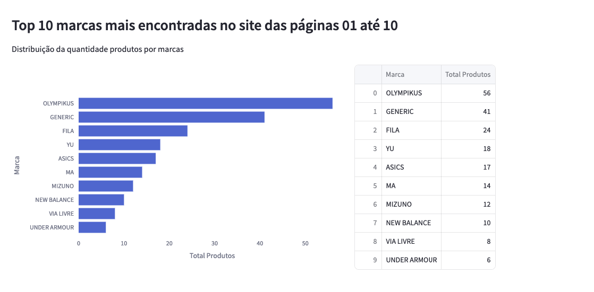

# Análise de Marcas de Tênis Esportivos Masculinos com Webscraping

Este README fornece uma visão geral clara e detalhada do projeto, incluindo a arquitetura, a estrutura de diretórios, as instruções de instalação e uso, além dos módulos específicos para extração, transformação e visualização de dados.

Uma ETL em Python para Monitoramento de Preço.

## **Uma ETL em Python para Monitoramento de Preço**:

Solução em Python para estratégias de pricing Temos uma pipeline e uma ETL em Python que coleta, consolida e gera insights sobre determinada cadeira de produtos.

## **Necessidade**: 

Precisamos entender a relevância das marcas de tênis esportivos masculinos no Mercado Livre. O objetivo desta pesquisa é avaliar como as diversas marcas são percebidas pelos consumidores e gerar métricas que respondam às seguintes perguntas:

- Quais são as marcas mais frequentemente encontradas nas primeiras 20 páginas do site?
- Qual é o preço médio dos tênis esportivos por marca?
- Qual é o nível de satisfação dos consumidores em relação a cada marca?

## Etapas do Projeto:

### Coleta dos Dados
- **Objetivo:** Extrair informações sobre tênis esportivos masculinos utilizando **Python** e o framework **Scrapy** para web scraping.

### Tratamento dos Dados
- **Objetivo:** Transformar e limpar os dados coletados utilizando a biblioteca **Pandas** para processamento de dados.

### Armazenamento dos Dados
- **Objetivo:** Armazenar os dados tratados de forma estruturada no banco de dados **SQLite3**.

### Visualização dos Dados
- **Objetivo:** Desenvolver indicadores utilizando a biblioteca **Pandas** para criar as análises e o framework **Streamlit** para visualização dos dados.

## Arquitetura do Projeto

Uma ETL em Python para Web Scraping

- Extração - Scrapy
- Transformação e Load - Pandas
- Banco de dados - SQLite
- Dashboard - Streamlit

###


## Dashboard





## Replicando o Projeto:

- Clone o repositório:

```bash
git clone https://github.com/antonyfferreira/projeto-webscraping.git

cd projeto_webscraping
```
- Configure a versão correta do Python com `pyenv`:
```bash
pyenv local 3.12.1
python -m venv .venv
```
- Instale as dependências do projeto:
```bash
# MacOS/Linux
source .venv/bin/activate 

# Windows
source .venv/Scripts/activate 

# Instalar as dependecias/bibliotecas que consta no arquivo requirements.txt
pip install -r requirements.txt
```
- Extração usando Webscraping
```bash
cd src/coleta/ 

rm ../../data/data_mercadolivre.jsonl # remove o arquivo json caso exista

scrapy crawl mercadolivre -o ../../data/data_mercadolivre.jsonl
```

- Tratamento dos dados e armazenamento:

    Dentro do diretório src execute o comando
```bash
python transformacao/processing.py
```
- Executar o Dashboard utilizando o Streamlit

    Dentro do diretório src execute o comando
```bash
streamlit run dashboard/app.py
````

## Documentação

- Python: https://www.python.org/
- Scrapy: https://scrapy.org/
- Pandas: https://pandas.pydata.org/
- SQLite: https://www.sqlite.org/
- Streamlit: https://streamlit.io/